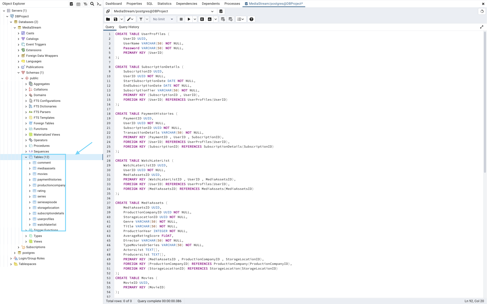
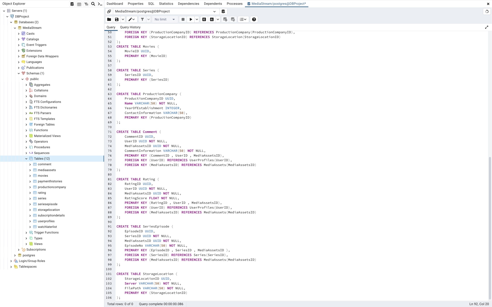

#  Media Streaming Service 🎞️
Let's Define every part ---> 🎬
1. [Requirements Analysis](#Requirements-Analysis)
2. [EER Diagrams](#EER-Diagrams)
3. [UML Diagrams](#UML-Diagrams)
4. [Logical Database Design](#Logical-Database-Design)
5. [SQL Operations](#SQL-operations)

## Requirements Analysis 🎯

***Main entities & Their attribute & DataType*** : 

* **UserProfiles**  
  + _UserID_ (_Primary key_) _:UUID_
  + _UserName_ _:String_
  + _Password_ _:String_
*  **SubscriptionDetails** 
   + _SubscriptionID_ (_Primary key_) _:UUID_
   + _UserID_ (_Foreign key_) _:UUID_
   + _StartSubscriptionDate_ _:Date_
   + _EndSubscriptionDate_ _:Date_
   + _SubscriptionTier_ _:String_
* **PaymentHistories**
     + _PaymentID_ (_Primary key_) _:UUID_
     + _UserID_ (_Foreign key_) _:UUID_
     + _SubscriptionID (_Foreign key_)  _:UUID_
     + _TransactionDetails_ _:String_
* **WatchLaterList**
     + _WatchLaterListID_ (_Primary Key_) _:UUID_
     + _UserID_ (_Foreign key_) _:UUID_
     + MediaAssets_ (_Foreign key_) _:UUID_
* **MediaAssets**
   +  _MediaAssetsID_(_Primary Key_) _:UUID_
   + _ProductionCompanyID_(_Foreign Key_) _:UUID_
   + _StorageLocationID_ (_Foreign key_) _:UUID_
   + _Genre_ _:String_
   + _Title_ _:String_
   + _ProductionYear_ _:Integer_
   + _AverageRatingScore_ _:Double_
   + _Director_ _:String_
   + _TypeMoviesORSeries_ _:String_
   + _ActorsList_ _:Array_
   + _ProducersList_ _:Array_
*  **Movies**
   + _MovieID_(_Primary Key_) _:UUID_
 * **Series**
   + _SeriesID_(_Primary Key_) _:UUID_
*  **ProductionCompany**
   + _ProductionCompanyID_ (_Primary Key_)_:UUID_
   + _Name_ _:String_
   + _YearOfEstablishment_ _:Integer_
   + _ContactInformation_ _:String_
* **Comment**
  + _CommentID_ (_Primary Key_) _:UUID_
  +  _UserID_ (_Foreign key_) _:UUID_
  + _MediaAssetsID_ (_Foreign key_) _:UUID_
  + _CommentInformation_ _:String_
* **Rating**
	+ _RatingID_ (_Primary Key_) _:UUID_
	+  _UserID_ (_Foreign key_) _:UUID_
	+  _MediaAssetsID_ (_Foreign key_) _:UUID_
	+ _RatingScore_ _:Double_
* **SeriesEpisode**
  + _EpisodeID_ (_Primary Key_) _:UUID_
  + _SeriesID_ (_Foreign key_) _:UUID_
  +  _MediaAssetsID_ (_Foreign key_) _:UUID_
  + _EpisodeNO_ _:String_
* **StorageLocation**
   + _StorageLocationID_ (_Primary key_) _:UUID_
  + _Server_ _:String_
  + _FilePath_ _:String_
  
  ***Description Of  Their RelationsShip*** : 
 
1. Each User has one Subscription Detail and Each Subscription Detail is available for one user (1..1:1..1)

2.  Each User has Many Payment Histories and Payment History is available for one user (1..1:0..N)

3. Each Subscription Detail has Many Payment Histories and Each Payment History is have one Subscription Detail (1..1:1..N)

4. Each user has one WatchLaterList and Each WatchLater movies can selected by Each User(1..1:1..1)

5.  Every Media in WatchLaterList contains many Media and Every Media can be in many WatchLaterList(0..N:0..M)

6. Each Media is made by one Production Company and Each Production Company can produce many Media(1..1:1..N)

7. Each Media has one Storage Location and one Storage Location can stored multiple Media items (1..1:1..N)

8. Movies and series are disjoint from MediaAssets ; Because MediaAssets should be one of them and can't be 2 of them simultaneously  and also they are Generalization of MediaAssets too

9. I get ProducersList and ActorsList as compositions because they contain additional details like name and age, etc

10. This part is Ternary because Each User can leave many comments on MediaAssets  (1..1:0..N) and Each Comment belongs to one MediaAsset and one User (1..1:0..N) and the end part as we said If users can leave multiple comments on the same MediaAsset the user-media relationship is many-to-many via comments (0..N:0..M)

11. Each User can rate many Medias and Each Media has only one Rating from Each User (0..1:0..N) 
And as in Chapter 4 (I mean "Entity versus Attribute") in this part I have treated Rating as an Attribute instead Entity

12. SeriesEpisode is Composition from series and Each Series have multiple episodes (1..1:1..N)

..
All primary keys are unique constraints as they represent that each row in a table of db can be uniquely identified. 
but NOTICE not all unique constraints are primary keys for instance -> Email for each User is unique but that doesn't mean that it is the primary key for the User.

  ## EER Diagrams 🎨
  
  
  ## UML Diagrams 🎨
  


## Logical Database Design ✨

Converting each table from the UML diagram to a database schema connected each foreign key to its  primary key.
For example, in the `MediaAssets` table we have the primary key `MediaAssetsID`. Other tables that reference this primary key via foreign keys have columns connecting to it. And like that I connected `ProductionCompanyID` in `MediaAssets` to the `ProductionCompany` table and `StorageLocationID` to the `StorageLocation` table.

I did not need to normalize my schema because:

-   **First Normal Form (1NF):** When handling composite attributes like `ActorList` or `ProducerList` I considered them as Arrays thats contain [names , last name]. This way there is no violation of 1NF since no multivalued attributes exist in the schema.
    
-   **Second Normal Form (2NF):** There are no partial functional dependencies in any of the tables !  so no changes are needed for this normalization step ,Too.

 


## SQL Operations 🔍

#### In this part I create every Table that my database needs.
`NOTICE` I added NOT NULL where it is mandatory or partially in the related Relations

  

  


#### There are 5 Advanced SQL Queries that I used in this project -->
1.  **Multiple JOIN Operations:** I used `JOIN` operations to combine data from multiple tables.


Well In this query I used `SELECT` at the outermost level because the result of the joins will display the combined data as a new table. first it checks `Userprofile.userID = SubscriptionDetail.userID`, and then it checks that `SubscriptionDetail.SubscriptionID = PaymentHistory.SubscriptionID`. If the subscription tier is `PRO`, the matching rows are included in the result. [the relationships like : a -> b, b -> c, then a -> c]


    
2.  **Aggregation Functions (GROUP BY):** I grouped the results by specific attributes (such as `ProductionCompanyID` or `TypeMoviesORSeries`) and performed aggregations. I grouped by `ProductionCompany` and counted how many movies or series each company produced.
  
 

In this query I used `SELECT` as shown above, and the `COUNT`, counts how many media entries exist in the MediaAssets table.Then it checks if `MediaAssets.ProductionCompanyID = ProductionCompany.ProductionCompanyID`. If they match it count+=1 for each group of production names.

3. **Merge & Same Password:** By merging each user has the same password.


In this query I merge the existing UserProfiles table with a new set of data. and next I define the new data to be inserted which includes `UserID`,`UserName` and `Password`.

When this query runs:

+ If a UserName from the new data already exists in the UserProfiles table the corresponding record is updated and its Password is changed to `same`.

+ If a UserName does not already exist a new record is inserted into the UserProfiles table and it doesn't change it to `same`
This process prove that duplicate UserName entries are avoided.

4.  **Find Ratings Above 2:** I selected the movies with a rating score higher than 2 from the `Rating` table.


In this query it checks for ratingScore values higher than 2. Notice that the data is ordered in descending order it means that is is sorted from highest to lowest. Because of `LIMIT 2` it selects the first and second highest ratingScore values

5.  **Ranking Rows:** I used SQL ranking functions to order the rows based on a specific criteria, such as ranking movies by their rating scores.


In this query `RANK()` function is used to create a new column named `ranking` And the ranking of the rows cannot be changed. The rows are ordered by `ratingScore` in descending order and the resulting ranking column assigns a rank to each row based on the ratingScore and the results are ordered by the ranking column.


### And here are the queries that I used for these 5 queries ::
```sql
-- Multiple JOIN Operations

SELECT * FROM SubscriptionDetails

INSERT INTO SubscriptionDetails (SubscriptionID, UserID, StartSubscriptionDate, EndSubscriptionDate, SubscriptionTier)
VALUES 
  (gen_random_uuid(), '616fadfc-c361-492d-9ad6-1469600765c0', '2020-01-01', '2024-11-06', 'PRO'),
  (gen_random_uuid(), 'd56c81a0-1671-4ee9-9a7a-10aa39d18ee9', '2010-08-01', '2024-02-23', 'PRO'),
  (gen_random_uuid(), 'bce7c17b-cb97-43f9-9b65-4b7d35d6056c', '2021-06-15', '2018-09-15', 'PREMIUM');

SELECT * FROM PaymentHistories

INSERT INTO PaymentHistories (PaymentID, UserID, SubscriptionID, TransactionDetails)
VALUES
    (gen_random_uuid(), '616fadfc-c361-492d-9ad6-1469600765c0', 'e83f342a-152c-4f11-a866-06d317ddc982', 'trans1INFO'),
	   (gen_random_uuid(), 'bce7c17b-cb97-43f9-9b65-4b7d35d6056c', '7127555c-8900-42a3-9088-d5c657f36295', 'trans2INFO'),
    (gen_random_uuid(), 'd56c81a0-1671-4ee9-9a7a-10aa39d18ee9', '6c71eb4c-4ce5-44ec-9325-59dbbc09e4dd', 'trans3INFO');


SELECT UserProfiles.UserID, UserProfiles.UserName, SubscriptionDetails.SubscriptionTier, PaymentHistories.TransactionDetails
FROM UserProfiles AS UserProfiles
INNER JOIN SubscriptionDetails AS SubscriptionDetails
  ON UserProfiles.UserID = SubscriptionDetails.UserID
INNER JOIN PaymentHistories AS PaymentHistories
  ON SubscriptionDetails.SubscriptionID = PaymentHistories.SubscriptionID
WHERE SubscriptionDetails.SubscriptionTier = 'PRO';
```


```sql
-- Aggregation Functions (GROUP BY)

INSERT INTO ProductionCompany (ProductionCompanyID, Name, YearOfEstablishment, ContactInformation)
VALUES
    (gen_random_uuid(), 'Universal Studios', 1912, 'reached at Universal Studios'),
    (gen_random_uuid(), 'Paramount Studios', 1912, 'reached at Paramount Studios'),
    (gen_random_uuid(), 'Walt Disney Studios', 1923, 'reached at Walt Disney Studios');

SELECT * FROM ProductionCompany

INSERT INTO MediaAssets (
    MediaAssetsID, ProductionCompanyID, StorageLocationID, Genre, Title, 
    ProductionYear, AverageRatingScore, Director, TypeMoviesORSeries, 
    ActorsList, ProducersList
)
VALUES
    (gen_random_uuid(), 'dd487919-3698-4790-9b91-da06f8307df6', gen_random_uuid(), 'Action', 'Maze Runner', 2014, 7.4, 'Wes Ball', 'Movie', ARRAY['Dylan OBrien', 'Kaya Scodelario', 'Thomas Brodie-Sangster'], 
    ARRAY['Ellen Goldsmith-Vein', 'Wyck Godfrey']),
    (gen_random_uuid(), 'b7c69beb-db45-4769-aedb-2aac5d2e2205', gen_random_uuid(), 'Adventure', 'The Hunger Games', 2012, 7.2, 'Gary Ross', 'Movie', ARRAY['Jennifer Lawrence', 'Josh Hutcherson', 'Liam Hemsworth'], ARRAY['Nina Jacobson', 'Jon Kilik']),
    (gen_random_uuid(), 'b7c69beb-db45-4769-aedb-2aac5d2e2205', gen_random_uuid(),'Fantasy', 'Stranger Things', 2016, 8.7, 'The Duffer Brothers', 'Series', ARRAY['Millie Bobby Brown', 'Finn Wolfhard', 'Winona Ryder'], ARRAY['Shawn Levy', 'Dan Cohen']);

SELECT * FROM MediaAssets

SELECT ProductionCompany.Name AS ProductionCompany, COUNT(MediaAssets.MediaAssetsID) AS TotalMovies
FROM MediaAssets AS MediaAssets
JOIN ProductionCompany AS ProductionCompany
  ON MediaAssets.ProductionCompanyID = ProductionCompany.ProductionCompanyID
GROUP BY ProductionCompany.Name;
```

```sql
-- Merge & Same Password

SELECT * FROM UserProfiles

INSERT INTO UserProfiles (UserID, UserName, Password)
VALUES
	(gen_random_uuid(), 'ColeSP', 'cool123'),
	(gen_random_uuid(), 'DylanOB', '3z3maze2018'),
	(gen_random_uuid(), 'JenniferLaw', '90hunger58'),
	(gen_random_uuid(), 'EmmyAD', 'sami04'),
 (gen_random_uuid(), 'SamWal', 'western34'),
 (gen_random_uuid(), 'Windy', 'tomQW022')


MERGE INTO UserProfiles users
USING (VALUES
    (gen_random_uuid(), 'ColeSP', 'cool123'),
    (gen_random_uuid(), 'DylanOB', '3z3maze2018'),
    (gen_random_uuid(), 'JenniferLaw', '90hunger58'),
    (gen_random_uuid(), 'EmmyAD', 'sami04')
) AS userProfile(UserID, UserName, Password)
ON users.UserName = userProfile.UserName
WHEN MATCHED THEN
    UPDATE SET Password = 'same'
WHEN NOT MATCHED THEN
    INSERT (UserID, UserName, Password)
    VALUES (userProfile.UserID, userProfile.UserName, userProfile.Password)
```

```sql
-- Find Ratings Above 2

INSERT INTO rating (ratingid, userid, mediaAssetsId,ratingScore)
VALUES
	(gen_random_uuid(), '313e5f97-18d1-4015-87cc-466fb337517f','466fb337517f-313e5f97-18d1-4015-87cc', 5),
	(gen_random_uuid(), '0b15cc43-f062-452a-a4c7-14a71a601a7a', '14a71a601a7a-0b15cc43-f062-452a-a4c7' , 8 ),
	(gen_random_uuid(), '4f768fc4-f481-41d8-aa38-123217c31912', '91555a487983-1e590de5-5977-4824-9973' , 1),
	(gen_random_uuid(), '1e590de5-5977-4824-9973-91555a487983', 'bb5476fd-6879-4756-9dfc-fbb89b8652f2' , 4)

SELECT ratingid, userid, mediaAssetsId, ratingScore
FROM rating
WHERE ratingScore > 2
ORDER BY mediaAssetsId, ratingScore DESC
LIMIT 2;
```

```sql
-- Ranking Rows

SELECT 
  ratingid,
  userid,
  mediaAssetsId,
  ratingScore,
  RANK() OVER (ORDER BY ratingScore DESC) as ranking
FROM rating
ORDER BY ranking;
```
### Here are some custom queries that I used for the first time to test my project::
```sql
INSERT INTO UserProfiles (UserID, UserName, Password)
VALUES (gen_random_uuid(), 'Grmobin', '2004');

UPDATE UserProfiles
SET UserName = 'mobina'
WHERE UserID = '8e7ddd58-0313-4852-8ff9-21753358efde';

DELETE FROM SubscriptionDetails
WHERE UserID = '58fac4ae-3584-4925-8a1d-3655c8d54e1b';

ALTER TABLE SubscriptionDetails
RENAME COLUMN TierSubscription TO SubscriptionTier;

ALTER TABLE DetailsOFSubscription
RENAME TO SubscriptionDetails;
```